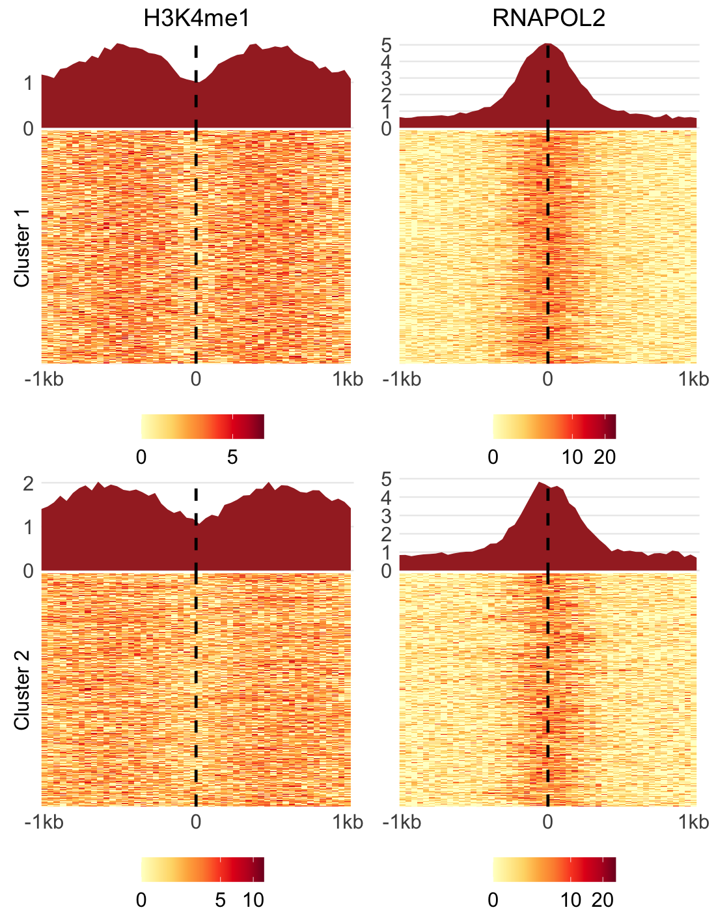
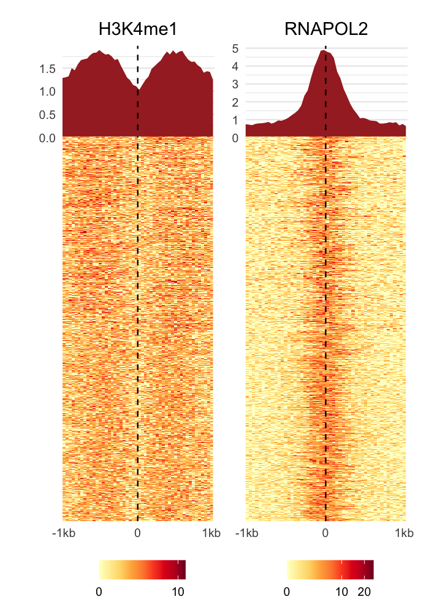
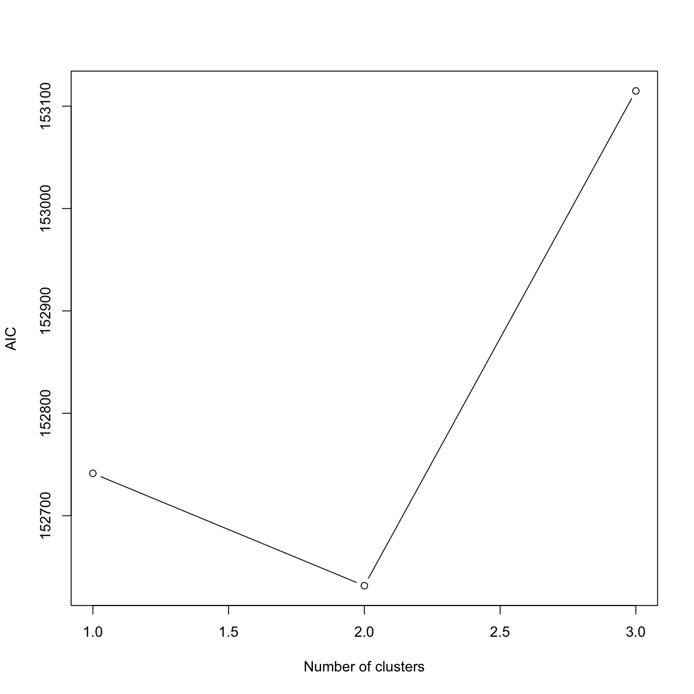
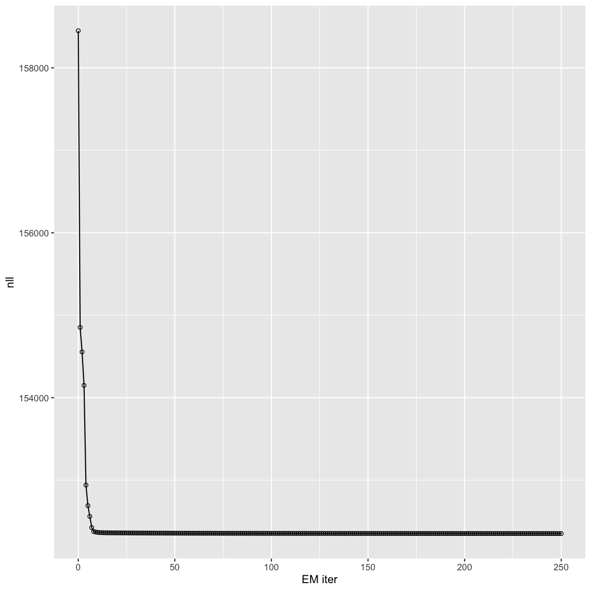
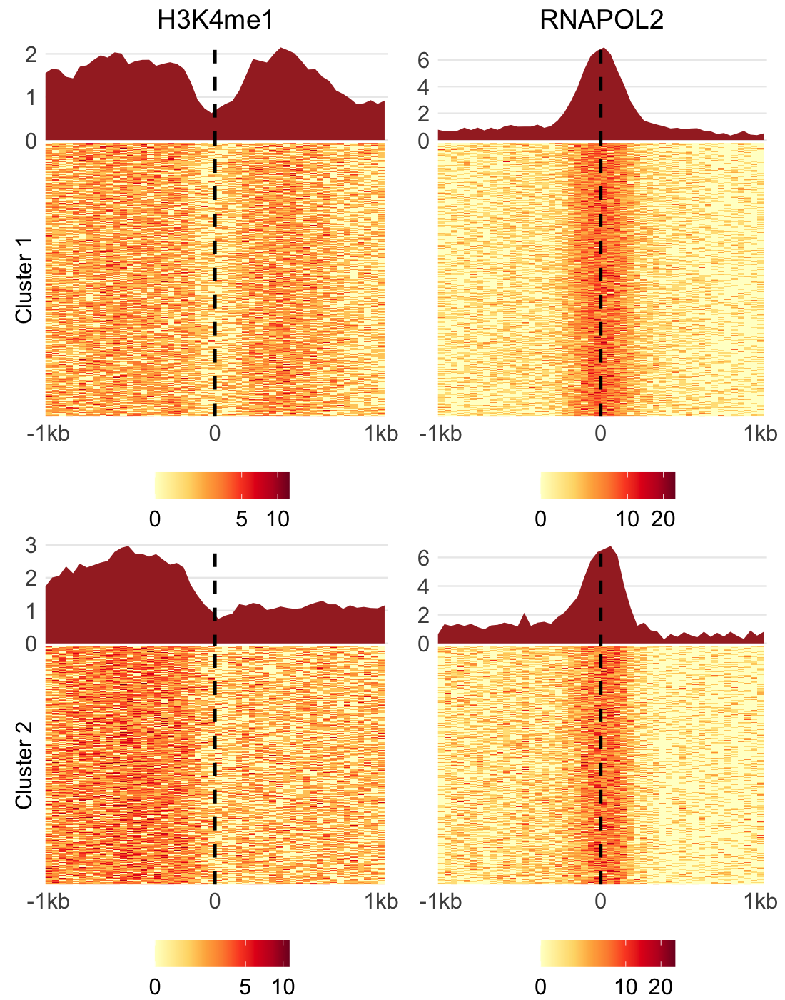
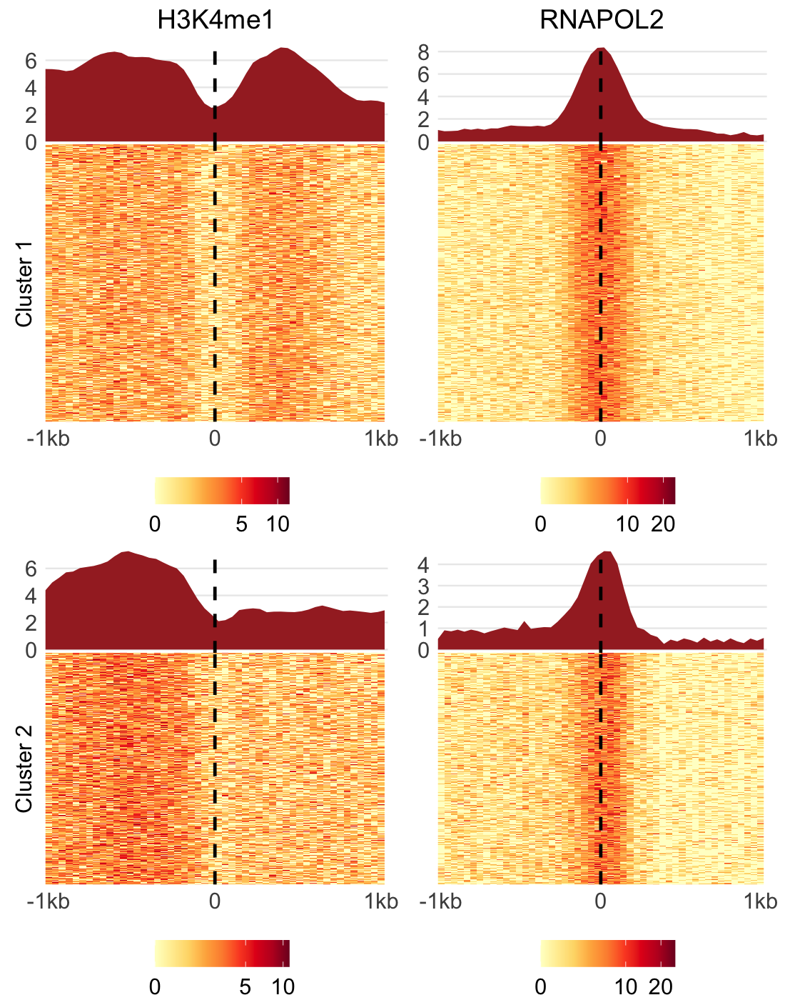
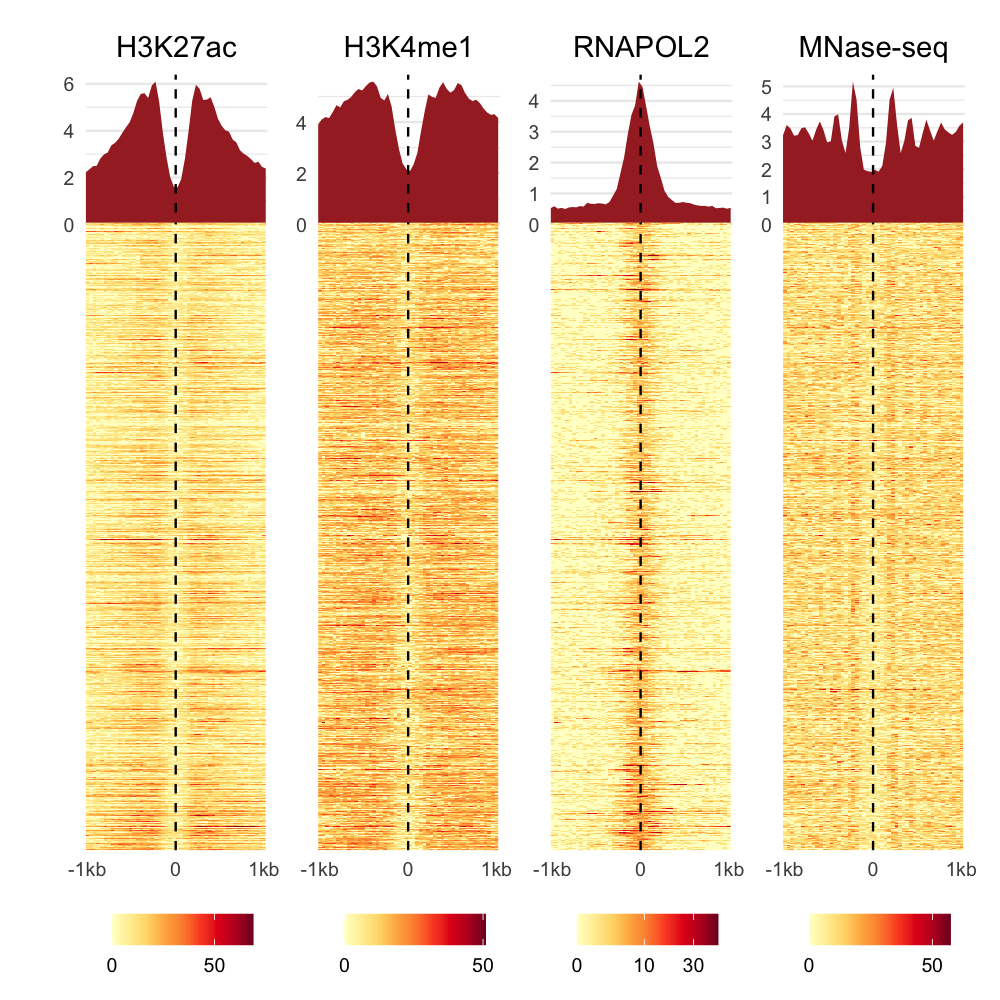
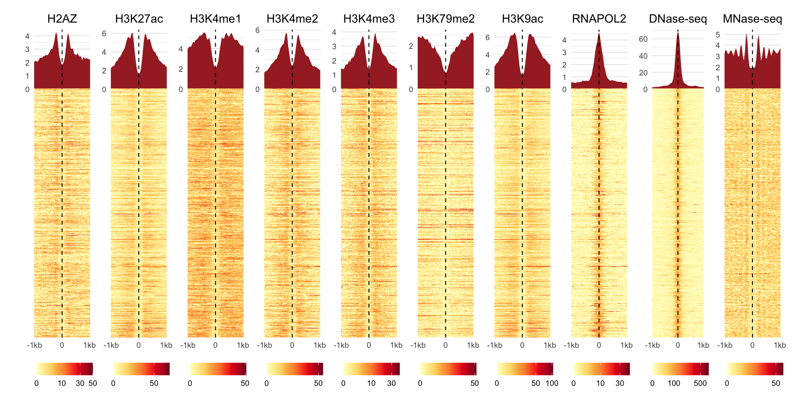

# ChromDMM

This R package contains ChromDMM, a Dirichlet-multinomial mixture model for clustering heterogeneous epigenetic data

## Installation

You can install the ChromDMM R package using [devtools](https://devtools.r-lib.org):

```R
devtools::install_github('MariaOsmala/ChromDMM')
```
ChromDMM depends on the following R-packages, which should be installed automatically when you install the `ChromDMM` package:

- [Rcpp](https://cran.r-project.org/web/packages/Rcpp/index.html)
- [ggplot2](https://cran.r-project.org/web/packages/ggplot2/index.html)
- [reshape2](https://cran.r-project.org/web/packages/reshape2/index.html)
- [GGally](https://cran.r-project.org/web/packages/GGally/index.html)
- [plyr](https://cran.r-project.org/web/packages/plyr/index.html)
- [S4vectors](https://bioconductor.org/packages/release/bioc/html/S4Vectors.html)
- [IRanges](https://bioconductor.org/packages/release/bioc/html/IRanges.html)
- [e1071](https://cran.r-project.org/web/packages/e1071/index.html)
- [RcppArmadillo](https://cran.r-project.org/web/packages/RcppArmadillo/index.html)
- [RcppGSL](https://cran.r-project.org/web/packages/RcppGSL/index.html)
   
## Running ChromDMM analysis

The scripts to reproduce a part of the results as described in the paper, are in the `scripts` folder.

Processing chromatin feature data, running the analysis and visualisation of the results depends on more software than just the ChromDMM package.
To install the required software, R and possible c/c++ compilers, we recommend using [anaconda](https://www.anaconda.com/products/individual) and the provided `conda_environment_linux.yml`
or `conda_environment_mac.yml` file:

```
conda env create -f ChromDMM/conda_environment.yml -n ChromDMM
source activate ChromDMM
```

The script `scripts/run_ChromDMM.R` performs the analysis. Run
```
Rscript scripts/run_ChromDMM.R --help
```
for the possible options. The scripts `scripts/plot_data.R` and `plot_data_without_clusters.R` can be used to visualise the data before and after clustering. `AICBIC.R` and `simulated_figures.R` produce visualisations of the results. Try `Rscript scripts/<script_name>.R --help` also for these functions.

### Simulated data clustering
The file`experiment_data/data.RDS` is an example of shifted and flipped simulated data that contains two chromatin features H3K4me1 and RNAPOL2 and two clusters. It is a list containing the following elements:

* data: List of two matrices named H3K4me1 and RNAPOL2 of size N=1000 x L=50, where N is the number of
genomic elements (e.g. enhancers) and L is the length of chromatin feature profiles/coverage counts. The coverage counts are originally extracted in genomic windows of size W=2000. Resolution B=40 results in profiles of length 50.
* labels: Vector of length N. True cluster labels (1 or 2). THe first 500 regions belong to cluster 1 and the rest belong to cluster 2.
* true.flips: Vector of length N, true flip states (1 or 2)
* true.shift.ind : Vector of length N, true flip state, value in range [1:21], S=21 is the number of possible shift states
* true.shift.bases: Vector of length N, true shifts in base pairs, values in range [-400, 400] and multiplication of 40
* tobe.unshifted.unflipped.binned.data: List of 2 matrices names H3K4me1 and RNAPOL2 of size N=1000 x L=70. This data is used to realign the profiles according to the learned shift states. The coverage counts are originally extracted in genomic windows of size 2800. Resolution B=70 results in profiles of length 70

Visualise the simulated data (DEBUG THIS!)

```
bin_size=40
data="experiment_data/simulated_data.RDS"

Rscript scripts/plot_data.R  --data $data --cluster 2 --bin.size $bin_size --name "shifted-flipped-data" 

```
<center>

</center>

Visualisation if the clustering is not known

```
bin_size=40
data="experiment_data/simulated_data.RDS"

Rscript scripts/plot_data_without_clusters.R  --data $data --bin.size $bin_size --name "shifted-flipped-data" 

```
<center>

</center>

The analysis is run as follows. The cluster number is varied from 1 to 3, and for each cluster number 10 repetitions are performed, each with random initialisation point. The computations can be parallelised across the multiple repetitions as well as across the varying number of clusters. The best model fit of the repetitions is retained for each cluster number. If parallel=TRUE, verbose should be set of FALSE. The analysis took ~6mins with 12 cpus and the total memory requirement was ~10G.
```
bin_size=1
data="experiment_data/simulated_data.RDS"

Rscript scripts/run_ChromDMM.R  --data $data --cluster 1,2,3 --bin.size $bin_size --verbose FALSE --shift 21 --flip TRUE --seed.boolean FALSE --repetition 10 --parallel TRUE --output "experiment_data/simulated_data_fit.RDS" 
```

AIC and BIC values for varying number of clusters. 

```
fit="experiment_data/simulated_data_fit.RDS"
name="simulated_data"

Rscript scripts/AICBIC.R  --fit $fit --name $name 

```

<center>
<table width=80%>
  <tr>
    <td style="text-align:center">AIC</td>
     <td style="text-align:center">BIC</td>
     
  </tr>
  <tr>
    <td></td>
    <td></td>
    
  </tr>
 </table>
</center>


Choose 2 for the number of clusters. Plot the negative log posterior as the function of EM iterations to check the convergence

```
fit="experiment_data/simulated_data_fit.RDS"
name="simulated_data"
Rscript scripts/simulated_figures.R  --fit $fit --cluster 2 --skip 4 --name $name 

```
<center>

</center>


`simulated_figures.R` also plots EM convergence diagnostics, see `figures/EM-diagnostics-simulated_data.png`

Realign the enhancers based on the inferred shift and flip states and visualise the clusters

```
data="experiment_data/simulated_data.RDS"
fit="experiment_data/simulated_data_fit.RDS"
name="simulated_data"
bin_size=40
Rscript scripts/plot_data.R  --data $data --fit $fit --bin.size $bin_size --cluster 2 --name $name 

```

<center>
<table width=80%>
  <tr>
    <td style="text-align:center">Average aggregate patterns</td>
     <td style="text-align:center">Smoothed Dirichlet parameters</td>
     
  </tr>
  <tr height = 20px>
    <td></td>
    <td></td>
    
  </tr>
  <tr>
    <td></td>
    <td></td>
    
  </tr>
 </table>
</center>


### Enhancer ENCODE data clustering

The chromatin features extracted at enhancers were obtained using the [PREPRINT](https://github.com/MariaOsmala/preprint) pre-processing steps with configuration `five_prime_end: TRUE` set in the `workflow/config.yaml`. An example output of PREPRINT pre-processing is given in file `experiment_data/1000_enhancers_bin_1_window_4000_only5prime.RData`. When extracting the chromatin feature coverage values at enhancers, only the 5' ends of the aligned reads were considered. See `scripts/process_true_enhancer_data.R` how to process to PREPRINT output to a ChromDMM compatible format (`experiment_data/1000_enhancers_4modifications.Rds`).

The ChromDMM compatible object in file `experiment_data/1000_enhancers_4modifications.Rds`
is a list of 3 elements:

* data is a list of 4. Each list element contains N x W chromatin feature data matrices. N is the number of elements and W is the genomic window (2000 bps). The chromatin features are H3K27ac, H3K4me1, RNA POL II, and MNase-seq. This data is given to the ChromDMM
* binned.data: same as data, but created with resolution B=40
* tobe.unshifted.unflipped.binned.data: List of 10 matrixes of size N x W. Data extracted originally in window W=2800 and binned with B=40.

The analysis is run as follows. The analysis can be run in parallel with 24 cpus, as the cluster number is varied from 3 to 8, and for each cluster number 5 repetitions are performed, each with random initialisation point. The best model fit of the
repetitions is retained. If parallel=TRUE, verbose should be set of FALSE. The analysis takes x hours/mins with 24 cpus, memory X/cpu.

Visualisation of the data

```
bin_size=40
data="experiment_data/1000_enhancers_4modifications.RDS"

Rscript scripts/plot_data_without_clusters.R  --data $data --bin.size $bin_size --bin.data TRUE --name "enhancers_4mods" --fig.width 1000 --fig.height 1000

```
<center>


</center>


The analysis is run as follows. The cluster number is varied from 2 to 8, and for each cluster number 10 repetitions are performed, each with random initialisation point. The analysis took ~24h with 24 cpus and the total memory requirement was ~25G.


```
data="experiment_data/1000_enhancers_4modifications.Rds"
bin_size=40

Rscript scripts/run_ChromDMM.R  --data $data --cluster 1,2,3,4,5,6,7,8 --bin.size $bin_size --verbose FALSE --shift 21 --flip TRUE --seed.boolean FALSE --repetition 10 --parallel TRUE --output "experiment_data/4mods_fit.RDS"
```

AIC and BIC values for varying number of clusters. 

```
fit="experiment_data/4mods_fit.RDS"
name="enhancers-4mods"

Rscript scripts/AICBIC.R  --fit $fit --name $name 

```

AIC            |  BIC
:-------------------------:|:-------------------------:
**TODO**  |  **TODO**

AIC and BIC likely underestimate the number of clusters, large number of samples are required. Let us choose 6 for the number of clusters. Plot the negative log posterior as the function of EM iterations to check the convergence

```
fit="experiment_data/4mods_fit.RDS"
name="enhancers-4mods"
Rscript scripts/simulated_figures.R  --fit $fit --cluster 6 --skip 1 --name $name 

```
**TODO**

`simulated_figures.R` also plots EM convergence diagnostics, see `figures/EM-diagnostics-enhancers-4mods.png`

Realign the enhancers based on the inferred shift and flip states and visualise the clusters

```
data="experiment_data/1000_enhancers_4modifications.Rds"
fit="experiment_data/4mods_fit.RDS"
name="enhancers-4mods"
bin_size=40
Rscript scripts/plot_data.R  --data $data --fit $fit --bin.size $bin_size --cluster 6 --name $name 

```
Average aggregate patterns            |  Smoothed Dirichlet parameters
:-------------------------:|:-------------------------:
**TODO**  |  **TODO**


The object in file file `experiment_data/1000_enhancers_10modifications.Rds`
is a list of 3 elements:

* data is a list of 10. Each list element contains N x W chromatin feature data matrices. N is the number of elements and W is the genomic window. The chromatin features are H2AZ, H3K27ac, H3K4me1, H3K4me2, H3K4me3, H3K79me2, H3K9ac, 
RNAPOL2, DNase-seq and MNase-seq. This data is given to the ChromDMM
* binned.data: same as data, but created with resolution B=40
* tobe.unshifted.unflipped.binned.data: List of 10 matrixes of size N x W. Data extracted originally in window W=2800 and binned with B=40.

The analysis is run as follows. The analysis can be run in parallel with 24 cpus, as the cluster number is varied from 3 to 8, and for each cluster number 5 repetitions are performed, each with random initialisation point. The best model fit of the
repetitions is retained. If parallel=TRUE, verbose should be set of FALSE. The analysis takes x hours/mins with 24 cpus, memory X/cpu.

Visualisation of the data


<center>

</center>


```
bin_size=40
data="experiment_data/1000_enhancers_10modifications.RDS"

Rscript scripts/plot_data_without_clusters.R  --data $data --bin.size $bin_size --bin.data TRUE --name "enhancers_10mods" --fig.width 2000 --fig.height 1000

```
**TODO**


```
data="experiment_data/1000_enhancers_4modifications.Rds"
bin_size=40
window=2000

Rscript scripts/run_ChromDMM.R  --data $data --cluster 1,2,3,4,5,6,7,8 --bin.size $bin_size --window $window --verbose FALSE --shift 21 --flip TRUE --seed.boolean FALSE --repetition 5 --parallel TRUE --output "data_experiments/10mods_fit.RDS"
```

## Citation

Osmala, M., Eraslan, G. & Lähdesmäki, H. (2022). ChromDMM: A Dirichlet-Multinomial Mixture Model For Clustering Heterogeneous Epigenetic Data (submitted)

## License

This project is licensed under the LGPL-3 License - see the [LICENSE](LICENSE) file for details

## Contact

Maria Osmala, MSc  
PhD student  
Aalto University School of Science  
Department of Computer Science  
Email: firstname.surname@aalto.fi  
Home Page: https://people.aalto.fi/maria.osmala

Gökcen Eraslan, PhD
Postdoctoral Researcher
Broad Institute of MIT and Harvard
Email: gokcen.eraslan@gmail.com
Home Page: http://linkedin.com/in/gokcen

Harri Lähdesmäki, D. Sc. (Tech)  
Associate Professor  
Aalto University School of Science  
Department of Computer Science  
Email: firstname.surname@aalto.fi  
Home Page: http://users.ics.aalto.fi/harrila

## Acknowledgments

The ChromDMM package is an extension of bioconductor package [DirichletMultinomial](https://bioconductor.org/packages/release/bioc/html/DirichletMultinomial.html): Dirichlet-Multinomial Mixture Model Machine Learning for Microbiome Data by Martin Morgan. DirichletMultinomial is an interface to [code](https://code.google.com/archive/p/microbedmm/) originally made available by [Holmes,Harris, and Quince, 2012, PLoS ONE 7(2): 1-15.](https://pubmed.ncbi.nlm.nih.gov/22319561/)
